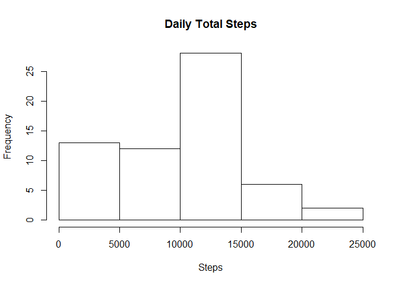
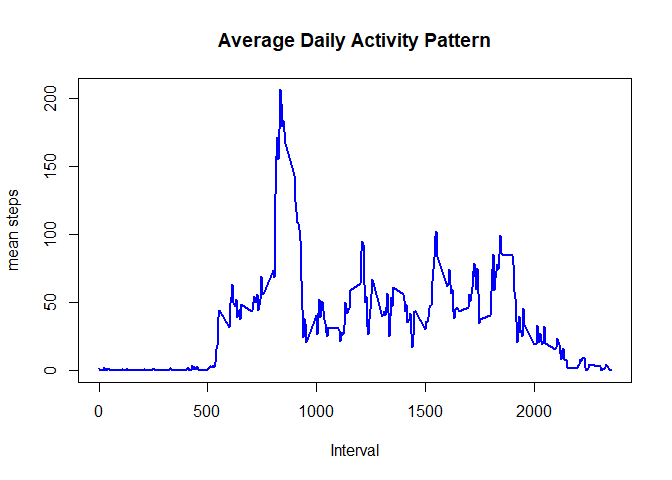
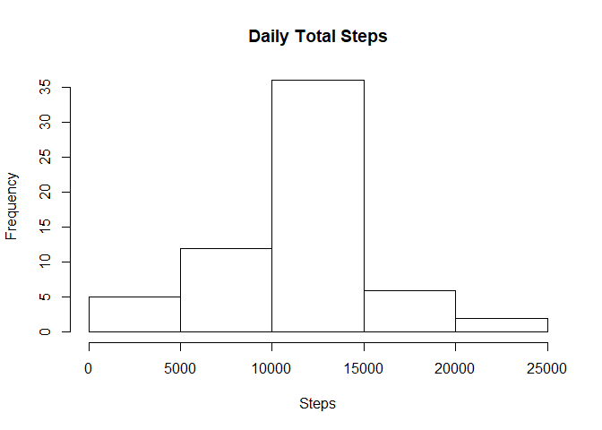
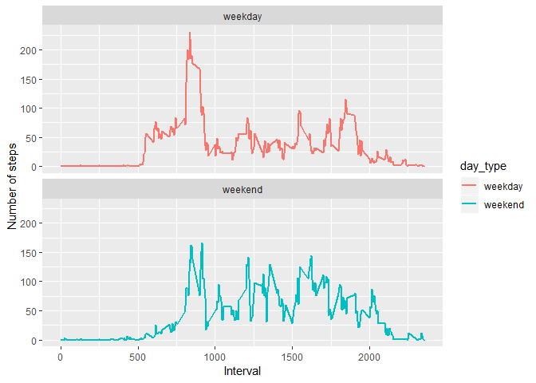

## This script analyzes activity monitoring data collected from an anonymous individual in Oct and Nov 2012.

## Loading and preprocessing the data


```r
# load packages
library(dplyr)
```

```
## Warning: package 'dplyr' was built under R version 3.5.2
```

```
## 
## Attaching package: 'dplyr'
```

```
## The following objects are masked from 'package:stats':
## 
##     filter, lag
```

```
## The following objects are masked from 'package:base':
## 
##     intersect, setdiff, setequal, union
```

```r
library(ggplot2)
```

```
## Warning: package 'ggplot2' was built under R version 3.5.2
```

```r
# read in the data
raw <- read.csv("activity.csv")

# add date
raw$date_string <- raw$date
raw$date <- as.Date(raw$date)
```

## What is mean total number of steps taken per day?


```r
# compute total number of steps by date
total_steps <- raw %>% group_by(date_string) %>% summarize(sum(steps, na.rm = TRUE))

# pull a vector out of the tibble (total_steps)
total_steps_vector <- pull(total_steps[,2])

# calculate mean and median of daily total steps
mean_total_steps <- mean(total_steps_vector, na.rm = TRUE)
median_total_steps <- median(total_steps_vector, na.rm = TRUE)

# histogram of daily total steps
hist(total_steps_vector, main = "Daily Total Steps", xlab = "Steps") 
```

<!-- -->

### The mean total number of steps taken per days is 9354.2295082 and the median is 10395

## What is the average daily activity pattern?


```r
# compute mean number of steps by time interval
mean_steps <- raw %>% group_by(as.factor(interval)) %>% summarize(mean(steps, na.rm = TRUE))

# pull vector out of the tibble (mean_steps)
mean_steps_vector <- pull(mean_steps[,2])
intervals <- unique(raw$interval)

# calculate the 5 minute interval contains the maximum number of steps
max_interval <- intervals[which.max(mean_steps_vector)]

# plot the mean steps per 5 minute interval
plot(mean_steps_vector ~ intervals, type = "l", col = "blue", lwd = 2, 
      main = "Average Daily Activity Pattern", xlab = "Interval", ylab = "mean steps")
```

<!-- -->

### This person took the maximum number of steps, on average, at time interval 835.

## Imputing missing values


```r
# calculate number of missing values
total_missing <- sum(is.na(raw$steps))


# fill in missing values using the mean for that 5 min interval
filled <- raw %>% group_by(interval) %>% mutate(avg = mean(steps, na.rm = T))
filled$steps[is.na(filled$steps)] <- filled$avg[is.na(filled$steps)]

# compute total number of steps by date
total_steps <- filled %>% group_by(date_string) %>% summarize(sum(steps))

# pull a vector out of the tibble (total_steps)
total_steps_vector <- pull(total_steps[,2])

# calculate mean and median of daily total steps
mean_total_steps <- mean(total_steps_vector)
median_total_steps <- median(total_steps_vector)

# histogram of daily total steps
hist(total_steps_vector, main = "Daily Total Steps", xlab = "Steps") 
```

<!-- -->

### There are 2304 missing values in the data. These were filled in with the mean of the steps for that 5-minute interval.

### After filling the missing values, the mean total number of steps taken per days is 1.0766189\times 10^{4} and the median is 1.0766189\times 10^{4}. These are both higher than the mean and median calculated without filling in the missing values.

## Are there differences in activity patterns between weekdays and weekends?

The plots indicate that there's a lot more activity in the morning on weekdays than on weekends, but less activity during work hours.


```r
# add factor variable day_type containing weekend or weekday
filled$day_type <- ifelse(weekdays(filled$date) %in% c("Saturday", "Sunday"), "weekend", "weekday") %>%             as.factor

# calculate average steps per interval
# compute mean number of steps by time interval
mean_steps <- filled %>% 
                  group_by(as.character(interval), as.character(day_type)) %>% 
                  summarize(mean(steps)) %>% 
                  as.data.frame

# rename the columns
names(mean_steps) <- c("interval", "day_type", "steps")

# panel plot
ggplot(mean_steps, aes(x = as.numeric(interval), y = steps, col = day_type)) +
  geom_line(size = 1) +
  facet_wrap(~day_type, nrow = 2) +
  xlab("Interval") +
  ylab("Number of steps")
```

<!-- -->
